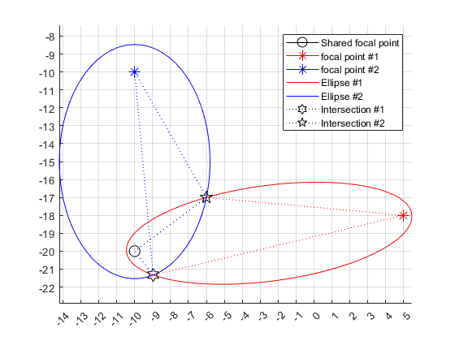
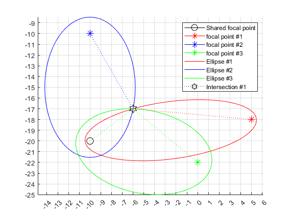
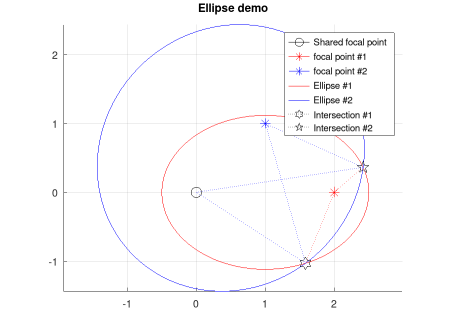
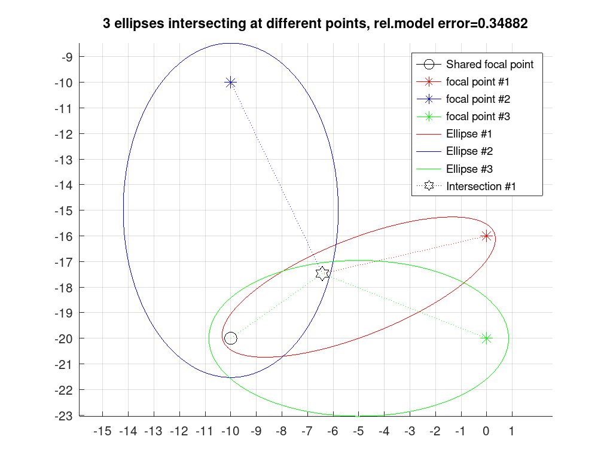

# On intersections of ellipses or spheroids with a shared focal point

Finding intersections of [ellipses](https://en.wikipedia.org/wiki/Ellipse) or [spheroids](https://en.wikipedia.org/wiki/Spheroid) is a fairly complicated task which typically involves solving a quartic equation with an iterative solver.
However, the story is very different if the ellipses/spheroids share a focal point.
We show below that the problem of finding the intersections reduces to the solution of a 4-by-4 (for spheroids) or a 3-by-3 (for ellipses) linear system. No iterative solver is needed. Also Matlab / Octave code for the solver and plenty of examples are given.

Let us begin with a couple of pictures of ellipses with a shared focal point. The intersections are shown as black stars and the shared focal point as a black circle.




## Theory

We describe the theory below only for spheroids. Ellipses are just 2D special cases of spheroids. Exactly same equations hold for ellipses by dropping the Z-coodinates.

Without loss of generality, we can assume that the shared focal point lies at the origin.
Assume we have $n$ spheroids. Denote the other focal point of spheroid $k=1...n$ by $f^k = (f_x^k, f_y^k, f_y^z)$.
Assume that $p = (x, y, z)$ is a point where all $n$ spheroids intersect.

Let us denote the distance from $p$ to the origin (i.e. to the shared focal point) by $w$. That is, $w = \vert\vert p \vert\vert$.
Furthermore, denote the distance from $p$ to the other focal point $f^k$ by $v_k$. That is, $v_{k} = \vert\vert p - f^k \vert\vert$.

By definition of the spheroid, the diameter of the $k$'th spheroid is $d_k = w + v_k$, meaning that $v_k = d_k - w$.
The leads us to the following system of $n+1$ equations.

$$\qquad\begin{cases}
 x^2 + y^2 + z^2 &= w^2 \\
{\left ( x - f^1_x \right )}^2 + {\left ( y - f^1_y \right )}^2 + {\left ( x - f^1_z \right )}^2 &= v_1^2 = {\left ( d_1 - w \right )}^2 \\
  & \vdots \\
{\left ( x - f^n_x \right )}^2 + {\left ( y - f^n_y \right )}^2 + {\left ( x - f^n_z \right )}^2 &= v_n^2 = {\left ( d_n - w \right )}^2  \\
\end{cases}\qquad\qquad\qquad (1)$$

Now expand the squares and subtract the first equation from the others. This gives a system of $n$ equations as follows.

$$\qquad\begin{cases}
-2 x f^1_x  + \left ({f^1_x}\right )^2 -2 y f^1_y + \left ({f^1_y}\right )^2 -2 z f^1_z + \left ({f^1_z}\right )^2 &=  d_1^2 - 2 d_1 w  \\
  & \vdots \\
-2 x f^n_x  + \left ({f^n_x}\right )^2 -2 y f^n_y + \left ({f^n_y}\right )^2 -2 z f^n_z + \left ({f^n_z}\right )^2 &=  d_n^2 - 2 d_n w  \\
\end{cases}\qquad\qquad (2)$$

But this is a system of $n$ linear equations with the unknown vector being ${\left ( x \ y \ z \ w \right )}^T$ like so

$$\qquad
\left(
 \begin{matrix}
  -2 f^1_x & -2 f^1_y & -2 f^1_z & -2 d_1 \\
  \vdots  & \vdots  & \vdots & \vdots  \\
  -2 f^n_x & -2 f^n_y & -2 f^n_z & -2 d_n
 \end{matrix}\right)
\left(
\begin{matrix}
  x \\
  y \\
  z \\
  w
\end{matrix}
\right) =
\left(
  \begin{matrix}
   d_1^2 - \left ({f^1_x}\right )^2 - \left ({f^1_y}\right )^2- \left ({f^1_z}\right )^2 \\
   \vdots \\
   d_n^2 - \left ({f^n_x}\right )^2 - \left ({f^n_y}\right )^2- \left ({f^n_z}\right )^2 \\
  \end{matrix}
\right)
\qquad\qquad (3)$$

If $n < 3$ (for spheroids), there are infinitely many solutions as the intersection is a curve in 3D space.
On the other hand 4 spheroids (or 3 ellipses) are enough to determine a unique intersection point.
So the number of spheroids of interest is $n=3$ or 4. Likewise, the interesting number of ellipses is $n=2$ or 3.
We will show below that for both ellipses and spheroids with a shared focal point, the number of intersections is always 0, 1 or 2.
It follows from the fact that all intersections are either the solution of the linear problem (3) or, as we will see, they can be solved from roots of a 2nd order polynomial.

If there are only 3 spheroids, meaning that the matrix on the left in equation (3) has only 3 rows, we can append a row of 4 zeros at the bottom to make it a 4-by-4 matrix.
Likewise, we append a zero to the end of the vector on the right.

Let's denote the matrix on the left-hand side of (3) by $\mathbf{T}$ and the vector on the right by $r$.
So equation (3) can be written as $\mathbf{T}\ u = r$ where $u^T = \left ( x \ y \ z \ w \right )$.

### Full rank matrix

If matrix $\mathbf{T}$ has full rank, the problem is solved with an ordinary matrix inversion. That is, $u = \mathbf{T} \setminus r$ in Matlab lingo.
Now $u(1:3) = \left [ x, y, z \right ]$ will be the intersection point and $u(4) = w$ is the distance between the intersection point and
the shared focal point (which was assumed to be the origin). That is, $w^2 = x^2 + y^2 + z^2$.

The matrix can have a full rank only if there are 4 spheroids intersect at one point only. Otherwise, the matrix will be rank deficient. We examine the solutions of the rank deficient cases below.

### Rank deficient matrix

Let's split matrix $\mathbf{T}$ into four 4-by-1 column vectors and denote them by $A$, $B$, $C$ and $D$. So equation (3) becomes

$$\qquad\qquad\left [ A \ B \ C \ D \right ] u = r \qquad\qquad\qquad\qquad (4)$$

If $\mathbf{T}$ is rank deficient and the rank is 3 (for spheroids) or 2 (for ellipses), the problem of finding the coordinates of the intersection points will reduce to finding roots of a 2nd order polynomial as we will see later. If the rank is less than that, the intersections are curves which are out of scope of this document.

Let's continue with spheroids. If the rank is 3, there are 4 ways the column vectors $A, B, C, D$ can depend on each other.
We'll go over each of these cases. But first we calculate QR-decomposition of matrix $T$ with $[\mathbf{Q}, \mathbf{R}] = qr(\mathbf{T})$.
The rank of $\mathbf{T}$  equals the number of non-zero elements on the diagonal of the upper triangular matrix $\mathbf{R}$.
Hence, if the rank is 3, there must be one and only one zero on the diagonal of $\mathbf{R}$.

#### Case 1: $A$ is zero

Assume that the zero is at the first element of the diagonal, so $\mathbf{R}_ {1,1}=0$. The means that the first column $A = {\left ( 0 \ 0 \ 0 \ 0 \right )}^T$.

In this case we can forget column $A$ and the $x$-coordinate for while and solve $y$, $z$ and $w$ from the 4-by-3 linear system

$$\qquad\qquad\left [ B \ C \ D \right ] {\left (y \ z \ w \right )}^T = r \qquad\qquad\qquad (5)$$

This can be done with Matlab solver like so: $yzw = \mathbf{T}(:, 2:4) \setminus r$.

But the first equation in (1) implies that $x = \pm \sqrt{w^2-y^2-z^2}$. This leaves us with two possible intersection points.

#### Case 2: $B$ is a multiple of $A$

Assume that the zero is at the second element of the diagonal, so $\mathbf{R}_ {2,2}=0$.
This means that $B = g_A \ A$ for some real number $g_A$.

As it happens, we can solve it simply as $g_A=\mathbf{R}_ {1,2} / \mathbf{R}_ {2,2}$.
Using $B = g_A A$ in (4) we get

$$\qquad\begin{matrix}
A x + g_A A y + C z + D w &= r \\
\Rightarrow A (x + g_A\ y) + C z + D w &= r
\end{matrix}$$

Now denote $t_A := x + g_A\ y$, meaning that $x = t_A - g_A\ y$. Then solve the 4-by-3 linear system $[A \ C \ D] \ {\left (t_A \ z \ w \right )}^T = r$ for $t_A$, $z$ and $w$.

Recall from (1) that

$$\qquad\begin{matrix}
w^2 = x^2 + y^2 + z^2 = {\left ( t_A - g_A\ y \right )}^2 + y^2 + z^2 \\
\Rightarrow  \left ( g_A^2 + 1 \right )\ y^2 - 2 g_A\ t_A\ y + \left ( t_A^2 + z^2 - w^2 \right ) = 0 \\
\end{matrix}\qquad\qquad\qquad (6)$$

This is a 2nd order polynomial of $y$ so we get two possible solutions for $y$. $z$ and $w$ were solved above and $x = t_A - g_A\ y$, which gives an $x$ for each solution of $y$.

#### Case 3: $C$ is a linear combination of $A$ and $B$

Assume that the zero is at the third element of the diagonal, so $\mathbf{R}_ {3,3}=0$.
This means that $C = g_A \ A + g_B \ B$ for some real numbers $g_A$ and $g_B$.

We can solve $g_A$ and $g_B$ from $\mathbf{R}$ by noting that (using Matlab notation)
$\mathbf{R} (1:2,3)\ {\left ( g_A \ g_B \right )}^T = \mathbf{R} (1:2,1:2)$. So, we solve a 2-by-2 upper triangular system

$$\qquad\qquad\left (
\begin{matrix}
g_A \\
g_B
\end{matrix}\right ) = \mathbf{R} (1:2,1:2) \setminus \mathbf{R} (1:2,3)$$

Using $C = g_A \ A + g_B \ B$ in (4) we get

$$\qquad\begin{matrix}
A x + B y + C z + D w &= r \\
\Rightarrow A (x + g_A\ z) + B (y + g_B\ z) + D w &= r
\end{matrix}$$

Now denote

$$\qquad\begin{matrix}
t_A := x + g_A\ z & \Rightarrow x = t_A - g_A\ z \\
t_B := y + g_B\ z & \Rightarrow y = t_B - g_B\ z \\
\end{matrix}$$

Then solve the 4-by-3 linear system $[A \ B \ D] \ {\left (t_A \ t_B \ w \right )}^T = r$ for $t_A$, $t_B$ and $w$.

Recall from (1) that

$$\qquad\begin{matrix}
w^2 = x^2 + y^2 + z^2 = {\left ( t_A - g_A\ z \right )}^2 + {\left ( t_B - g_B\ z \right )}^2 + z^2 \\
\Rightarrow  \left ( g_A^2 + g_B^2 + 1 \right )\ z^2 - 2 \left (g_A\ t_A\ + g_B\ t_B\ \right )\ z + \left ( t_A^2 + t_B^2 - w^2 \right ) = 0 \\
\end{matrix}\qquad\qquad\qquad (7)$$

This is a 2nd order polynomial of $z$ so we get two possible solutions for $z$. $w$ was solved above and $x = t_A - g_A\ z$ and $y = t_B - g_B\ z$ which give a $x$ and $y$ for each solution of $z$.

#### Case 4: $D$ is a linear combination of $A$, $B$ and $C$

Assume that the zero is at the fourth element of the diagonal, so $\mathbf{R}_ {4,4}=0$.
Notice that this happens typically when we have only 3 spheroids, meaning that we have added a fourth row of zeros to matrix $\mathbf{T}$ above to make it 4-by-4.

This means that $D = g_A \ A + g_B \ B + g_C \ C$ for some real numbers $g_A$, $g_B$ and $g_C$.


We can solve $g_A$, $g_B$ and $g_C$ from $\mathbf{R}$ by noting that (using Matlab notation)
$\mathbf{R} (1:3,4)\ {\left ( g_A \ g_B \ g_C \right )}^T = \mathbf{R} (1:3,1:3)$. So, we solve a 3-by-3 upper triangular system

$$\qquad\qquad\left (
\begin{matrix}
g_A \\
g_B \\
g_C
\end{matrix}\right ) = \mathbf{R} (1:3,1:3) \setminus \mathbf{R} (1:3,4)$$

Using $D = g_A \ A + g_B \ B + g_C \ C$ in (4) we get

$$\qquad\begin{matrix}
A x + B y + C z + D w &= r \\
\Rightarrow A (x + g_A\ w) + B (y + g_B\ w) + C (z + g_C\ w) &= r
\end{matrix}$$

Now denote

$$\qquad\begin{matrix}
t_A := x + g_A\ w & \Rightarrow x = t_A - g_A\ w \\
t_B := y + g_B\ w & \Rightarrow y = t_B - g_B\ w \\
t_C := z + g_C\ w & \Rightarrow z = t_C - g_C\ w \\
\end{matrix}$$

Then solve the 4-by-3 linear system $[A \ B \ C] \ {\left (t_A \ t_B \ t_C \right )}^T = r$ for $t_A$, $t_B$ and $t_C$.

Recall from (1) that

$$\qquad\begin{matrix}
w^2 = x^2 + y^2 + z^2 = {\left ( t_A - g_A\ w \right )}^2 + {\left ( t_B - g_B\ w \right )}^2 + {\left ( t_C - g_C\ w \right )}^2 \\
\Rightarrow  \left ( g_A^2 + g_B^2 + g_C^2 - 1 \right )\ w^2 - 2 \left (g_A\ t_A\ + g_B\ t_B + g_C\ t_C\ \right )\ w + \left ( t_A^2 + t_B^2 + t_C^2  \right ) = 0 \\
\end{matrix}\qquad\qquad\qquad (8)$$

This is a 2nd order polynomial of $w$ so we get two possible solutions for $w$.
Equations $x = t_A - g_A\ wy$, $y = t_B - g_B\ w$ and $z = t_C - g_C\ w$ give a $x$, $y$ and $z$ for each solution of $w$.

**Note**: in every case 1...4 above, it is possible that the zeros of the 2nd order polynomials are complex numbers. If this is the case, the ellipses / spheroids do not intersect. This can happen for example if they are concentric.

## Matlab / Octave solver

The solver can be found in file [solveEllipseIntersections.m](octave/solveEllipseIntersections.m).
The same solver works for both ellipses and spheroids. If the input coordinate vectors have 2 elements, the solver works in 2D mode solving intersections of ellipses. If they have 3 elements, it works in 3D mode for spheroids.

The prototype of the function is

````MATLAB
    function [intersectionPoints, relativeModelError] = solveEllipseIntersections(sharedFocalPoint, otherFocalPoints, diameters)
````

**Inputs**
- `sharedFocalPoint` $~$  Coordinate of the focal point shared by all ellipses / spheroids. A $2\times 1$ vector for ellipses or a $3\times 1$ for spheroids.
- `otherFocalPoints` $~$  The other $N$ (non-shared) focal points as a $2\times N$ or $3\times N$ matrix. In 2D mode, $N$ must be either 2 or 3. In 3D mode, $N$ must be either 3 or 4. So you can solve intersections of either 2 or 3 ellipses, or 3 or 4 spheroids.
- `diameters` $~~$  Diameters of the ellipses / spheroids along the major semiaxes as an $N$-by-1 vector.

**Outputs**
- `intersectionPoints` $~$ Coordinates of the points where the $N$ ellipses / spheroids intersect as column vectors. If there are $M$ intersection points, the output is a $2\times M$ or $3\times M$ matrix. $M$ is either 0, 1 or 2. So the matrix is empty if the ellipses or spheroids do not intersect at all.
- `relativeModelError` $~$ (_optional_) Relative difference between the actual squared distance of the calculated intersection point(s)
                            from the shared focal point and the squared distance predicted by the model.
                            In terms of equations, $\epsilon =  \sqrt\frac{\vert x^2+y^2+z^2 - w^2 \vert}{x^2+y^2+z^2}$ where $x,y,x$ is the relative position of the intersection point with respect to the shared focal point.
                            If the relative error is 'large', say, bigger than 0.01, there is reason to believe that accuracy of the returned intersection points is not perfect. The reason can for instance be measurement errors in the input diameters.

### First example

Here is a example on how to solve intersections of two ellipses.

````MATLAB
    % Coordinates of the shared focal point as a column vector
    sharedFocalPoint = [0 0]';

    % The other focal points of two ellipses at (2,0) and (1,1) as column vectors
    otherFocalPoints = [2 0; 1 1]';

    % Diameters of the ellipses
    diameters = [3 4]';

    % Calculate intersections
    [intersections, relativeModelError] = solveEllipseIntersections(sharedFocalPoint, otherFocalPoints, diameters)

    % Show the ellipses
    plotEllipses(sharedFocalPoint, otherFocalPoints, diameters, intersections, "Ellipse demo");
````

The output will be

````MATLAB
intersections =

   1.5817   2.4183
  -1.0306   0.3639

relativeModelError =

   2.4961e-08   3.2242e-08
````



### More examples

There are scripts which give examples of all four rank deficient cases described in earlier chapters. Matlab and Octave scripts are living in separate folders because the way they produce graphics output is slightly different.

- [demo2D_2.m](octave/demo2D_2.m) has examples on intersections of 2 ellipses. The pictures generated by this script are [2-ellipses-case-1.png](pictures/2-ellipses-case-1.png), [2-ellipses-case-2.png](pictures/2-ellipses-case-2.png) and [2-ellipses-case-3.png](pictures/2-ellipses-case-3.png).
- [demo2D_3.m](octave/demo2D_3.m) has examples on intersections of 3 ellipses. The pictures generated by this script are [3-ellipses-case-1.png](pictures/3-ellipses-case-1.png), [3-ellipses-case-2.png](pictures/3-ellipses-case-2.png) and [3-ellipses-case-3.png](pictures/3-ellipses-case-3.png). The last picture shows the case where there is only one intersection point.
- [demo3D_3.m](octave/demo3D_3.m) has examples on intersections of 3 spheroids. The pictures generated by this script are [3-spheroids-case-1.png](pictures/3-spheroids-case-1.png), [3-spheroids-case-2.png](pictures/3-spheroids-case-2.png), [3-spheroids-case-3.png](pictures/3-spheroids-case-3.png) and [3-spheroids-case-4.png](pictures/3-spheroids-case-4.png).
- [demo3D_4.m](octave/demo3D_4.m) has examples on intersections of 4 spheroids. The pictures generated by this script are [4-spheroids-case-1.png](pictures/4-spheroids-case-1.png), [4-spheroids-case-2.png](pictures/4-spheroids-case-2.png), [4-spheroids-case-3.png](pictures/4-spheroids-case-3.png) and [4-spheroids-case-4.png](pictures/4-spheroids-case-4.png). The last picture shows the case where there is only one intersection point.


## Effect of measurement errors

Assume that the diameters are measured somehow and the measurements contain small errors. In this case it may happen that the ellipses / spheroids do not appear to intersect at the same point. Let's take a look at an example where noise has been added to diameters of three ellipses which otherwise intersect at a single point (like in [this picture](pictures/3-ellipses-case-3.png)).



Despite the errors in the diameter lengths, the intersection point given by the solver is still 'near' the true intersection point. However, it is not possible to say exactly how near. All we can say is that the less error there is in the measured diameters, the closer the solution is to the true intersection point.
We also know that the more error there is in the measurements, the larger the relative model error output is. But again, the relative model error does not say how far the given solution is from the correct one. All we can say is that the smaller the error output, the better.
